# Ladospice — Step-by-Step Guide

> Hướng dẫn sử dụng tool tạo quảng cáo. Version: July 2026
>
> **Screenshots:** Chụp ảnh thực tế và lưu vào `docs/screenshots/`.

---

## 1. Đăng nhập

1. Nhập email `@ladospice.com` + password → Click **"Sign In"**, hoặc click **"Sign in with Google"** để đăng nhập bằng tài khoản Google
2. Quên mật khẩu? Click "Forgot password?" → nhập email → check inbox

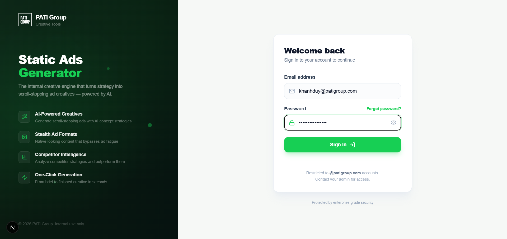

---

## 2. Chọn / Thêm Thương hiệu (Brand)

Không còn khái niệm "Client" — **Brand** là đơn vị cao nhất, chọn qua dropdown ở **cuối sidebar trái** (không phải trên header).

1. **Thêm thương hiệu** (chỉ Admin — CEO/Super Admin): cuối dropdown Brand → click **"Thêm thương hiệu"** → nhập tên → **Create**
2. **Chuyển brand:** click dropdown "Thương hiệu" ở sidebar → chọn brand khác
3. **Đổi tên / Xóa:** click icon **"⋯"** cạnh dropdown → **"Đổi tên"** (mọi user) hoặc **"Xóa"** (chỉ Admin)

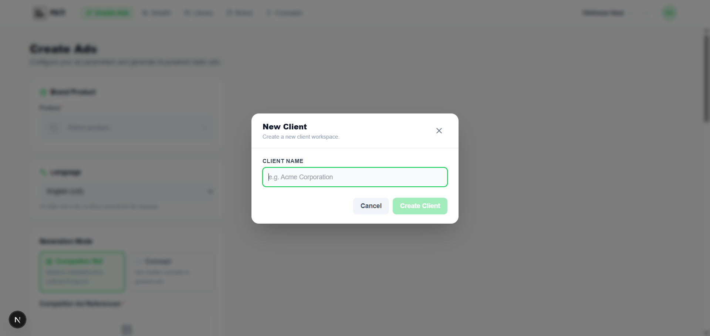

---

## 3. Thiết lập Brand Identity

Vào **Thương hiệu** trên sidebar (`/app/brands`) → điền các phần sau → click **"Save Brand Kit"**.

| Phần | Cách làm |
|------|----------|
| Brand Name | Nhập tên brand (bắt buộc) |
| Description | Mô tả brand (giúp AI hiểu tốt hơn) |
| Typography | Chọn Google Font hoặc upload font riêng |
| Color Palette | Click 6 ô màu: Primary×2, Secondary×2, Accent×2 |
| Logo | Upload Logo Light + Logo Dark (SVG/PNG/JPG, max 2MB) |

Panel bên phải hiển thị **Live Preview** real-time.

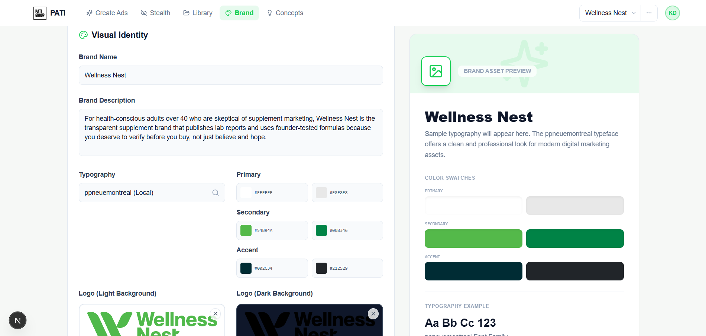

---

## 4. Quản lý Products

Trong Brand Setup → tab **"Products"**.

### Thêm Product

1. Click **"Add Product"**
2. Điền: Name, Description, Product URL, upload Images (max 5)
3. Click **"Create Product"**

### Scrape & Cache Product Data

Click nút **"Scrape"** trên product card để AI đọc trang sản phẩm.
- ✅ "Product data cached" → sẵn sàng generate
- ⚠️ "Not yet scraped" → cần scrape trước

### Product Colors (tùy chọn)

Edit product → expand **Product Colors** → set 6 màu riêng cho product (override brand colors).

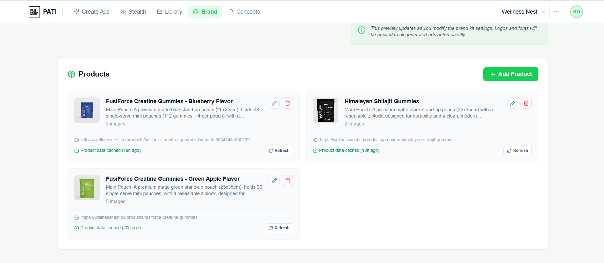

---

## 5. Tạo Personas

Brand Setup → tab **"Personas"**.

- **Auto-generate:** Có Research Summary → click **"Generate 10 Profiles"**
- **Thêm thủ công:** Click **"Add Profile"** → điền Title, Pain, Angle, Emotion

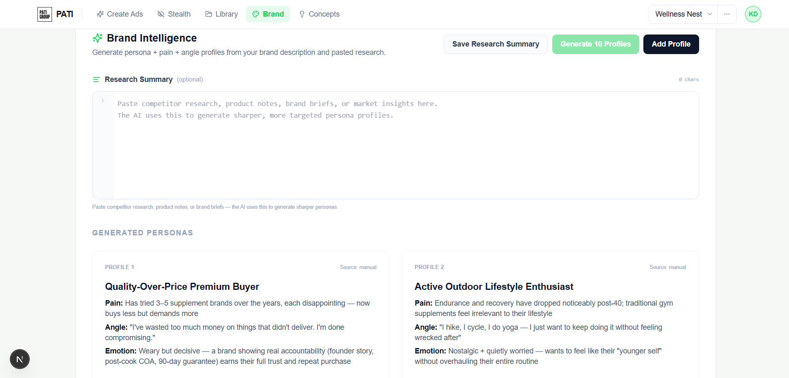

---

## 6. Tạo quảng cáo — Concept Mode

Vào **Tạo quảng cáo** trên sidebar (`/app`). Layout 2 cột: trái (config) | phải (results).

### Config (cột trái)

1. **Product** — chọn từ dropdown (hiển thị ảnh thumbnail)
2. **Language** — ngôn ngữ cho ad copy
3. **Mode** — chọn "Concept-Based"
4. **Concepts** — check 1+ concepts (Data Hook, Social Proof, etc.)
5. **Ad Copy Override** (tùy chọn) — ghi đè headline/body
6. **Target Audience** — check 1+ personas
7. **Output** — aspect ratio (1:1, 4:5, 9:16) + số lượng (1-10)

Click **"Generate Ads"**.

### Results (cột phải)

- Progress: 5 steps (Read page → Analyze → Concept → Prompt → Generate)
- Results: cards với Save | Copy | Download | Delete
- Bulk: **Save All** | **Download ZIP**
- Ads đã save vẫn hiển thị, chỉ mất khi reload trang

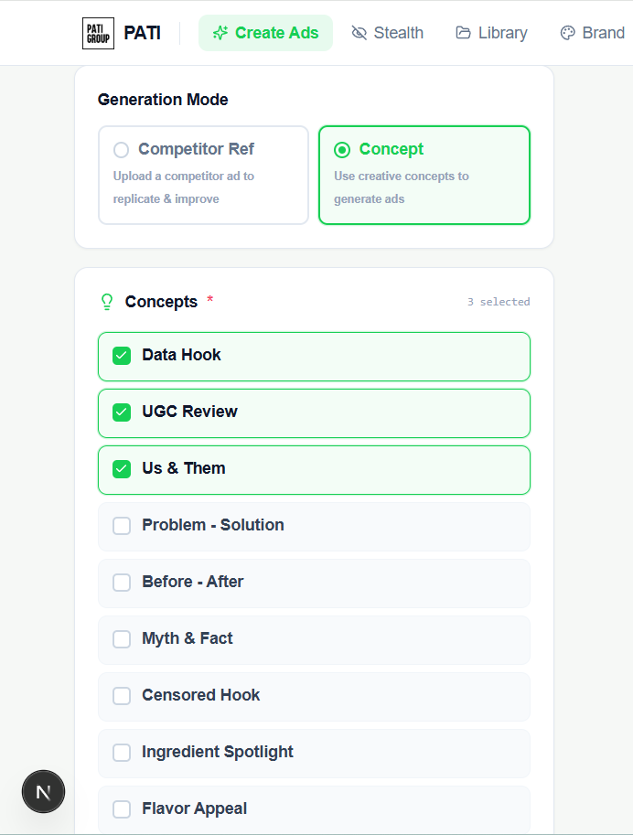

---

## 7. Tạo quảng cáo — Competitor Reference Mode

Trong **Tạo quảng cáo** → **Generation Mode** → chọn **"Competitor Reference"**.

1. Upload ảnh quảng cáo đối thủ (có thể upload nhiều — Pack mode)
2. Chọn sub-mode:
   - **Standard Ad** — replicate layout, thay product/colors/text
   - **Stealth Ad** — 2 bước: Plan Scenes → Generate (thêm Sensitivity + Age Range)
3. Chọn Product, Language, Personas, Output → **"Generate Ads"**

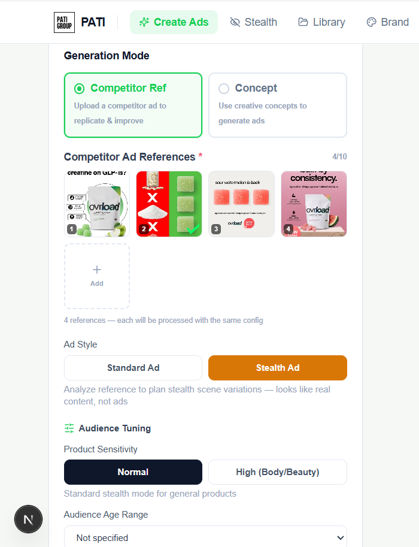

---

## 8. Tạo Stealth Ads

Vào **Stealth Ads** trên sidebar (`/app/stealth-ads`). Flow 2 bước: Plan → Generate.

### Step 1: Plan Scenes

1. Chọn Product, Personas
2. **Audience Tuning:** Sensitivity (Normal/High) + Age Range
3. **Scene Selection:** Auto (AI chọn) hoặc Manual (chọn từ 45 scenes: HUM, ENV, FMT, STR)
4. Click **"Plan Scenes"** → AI tạo scene plans
5. Review & edit plans (inline edit, reorder, delete, regenerate)

### Step 2: Generate

Click **"Generate"** → ảnh stealth sinh ra qua SSE stream → Save/Download.

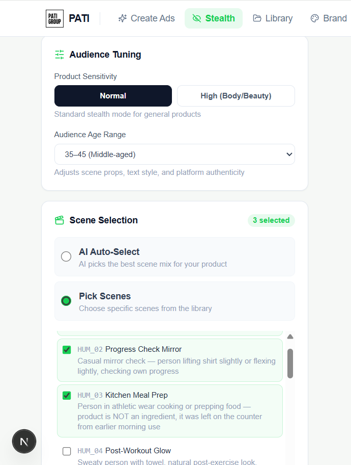

---

## 9. Ad Library — Xem, Filter, Edit

Vào **Thư viện** trên sidebar (`/app/library`).

### Filter

| Filter | Cách dùng |
|--------|-----------|
| **Product** | Dropdown chọn product → chỉ hiện ads của product đó |
| **Date** | All Time / Today / This Week / This Month / Last Month |
| **Search** | Tìm theo filename |

### Xem & Edit

- Click ảnh → **Detail Modal** (Product Reference tự động fill)
- Nhập Edit Prompt → click **"Edit"** → AI tạo phiên bản mới → Save

### Bulk Actions

Check nhiều ads → **Download ZIP** | **Adapt Content** | **Delete**

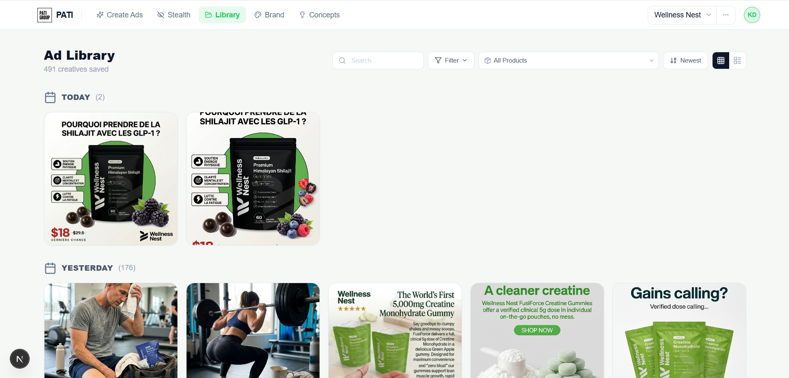

---

## 10. Content Adaptation

1. Trong Library → check ads → click **"Adapt Content"**
2. Chọn product (cần đã scrape) + ngôn ngữ → **"Continue"**
3. AI rewrite captions với product data → copy từng caption hoặc copy tất cả

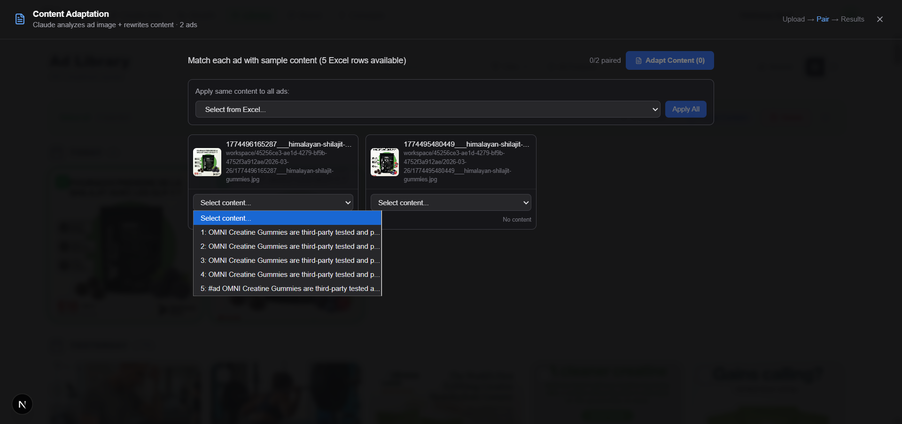

---

## 11. Quản lý Concepts (Admin)

Vào **Concept** trên sidebar, mục "Thiết lập" (`/app/concepts`).

- Xem: expand card → full prompt + reference images
- Thêm: **"Add Concept"** → ID, Label, Prompt (dùng `### Variant A/B` cho layout variety), Reference Images (max 2)
- Edit/Delete: icons trên card

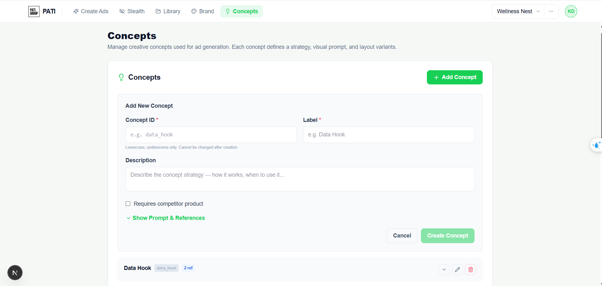

---

## 12. Admin Dashboard

Vào **Admin** (icon shield trong sidebar) — chỉ CEO + Super Admin, người khác bị chuyển hướng về Home.

Trang admin hiện là **dashboard thống kê** (page views, visitors, số tài khoản, số ads đã lưu, biểu đồ theo ngày, top pages) — không còn quản lý user hay chỉnh API key từ UI:

- Chọn khoảng thời gian: Today / Last 7 Days / Last 30 Days
- API keys (Anthropic, Google, KIE, Vbee, ElevenLabs, Apify) chỉ đọc từ biến môi trường server — cần sửa trên hosting và deploy lại, không sửa được trong app
- Quản lý user (tạo/xoá/đổi role) hiện thực hiện trực tiếp qua Supabase, không có UI trong app

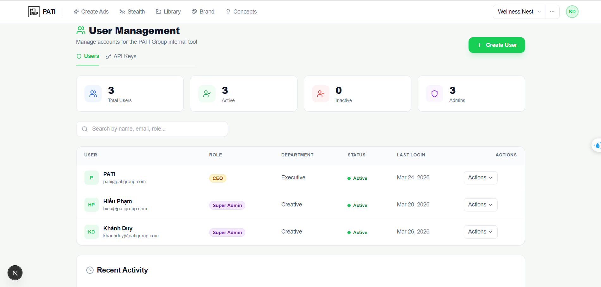

---

## 13. Video Pipeline — Crawl, Bóc băng, Kịch bản, Giọng đọc

Vào **Video Trending** trên sidebar (`/app/video`), mục "Video".

### Danh sách video

1. Video TikTok đối thủ tự động crawl qua Apify (lịch: Thứ 2 + Thứ 5, 10h sáng), hoặc:
   - Click **"Sync Apify"** để đồng bộ thủ công
   - Click **"+ Add Video"** → dán link TikTok → **Add**
2. Filter theo Status: Pending / Approved / Rejected. Đổi status trên từng card.
3. Click vào 1 video để mở trang chi tiết.

### Pipeline 4 bước (trang chi tiết video)

| Bước | Hành động |
|------|-----------|
| **1. Bóc băng** | Click "Bóc băng" → Gemini 2.5 Flash nghe audio TikTok, trả về lời thoại tiếng Việt. Sửa lại nếu cần. |
| **2. Kịch bản** | Chọn Product → Generate → Claude viết lại kịch bản mới theo giọng brand, giữ cấu trúc/nhịp gốc. Sửa & Save. |
| **3. Giọng đọc** | Chọn Voice Preset (đã tạo ở Voice Config) → Generate → tạo file audio qua Vbee hoặc ElevenLabs. |
| **4. Hoàn tất** | Tự động khi đã có audio — không cần thao tác thêm. Audio xuất hiện trong Thư Viện Audio. |

### Thư Viện Audio & Cấu Hình Giọng

- **Thư Viện Audio** (`/app/video/audio`) — nghe lại mọi audio đã tạo, xem script gốc, đánh giá chất lượng (sao).
- **Cấu Hình Giọng** (`/app/video/voice-config`) — tạo/sửa Voice Preset cho Vbee hoặc ElevenLabs, nghe thử trước khi lưu.

---

## Lưu ý quan trọng

- **Product Images quan trọng nhất** — dùng 3-5 ảnh high-res từ nhiều góc
- **Text luôn nhất quán** — Title Case hoặc ALL CAPS, không random mixed case
- **Logo không bị sáng tạo** — nếu có logo đính kèm, AI dùng đúng nguyên bản
- **Scrape product data trước** — Brand Setup → Products → Scrape
- **Product filter trong Library** — filter nhanh ads theo sản phẩm
- **Bóc băng trước khi viết kịch bản** — bước Kịch bản chỉ mở khi Transcript đã "done"
- **Tạo Voice Preset trước** — cần ít nhất 1 Voice Preset (Vbee/ElevenLabs) mới generate được giọng đọc

---

*Last updated: July 2026 — Ladospice Internal*
